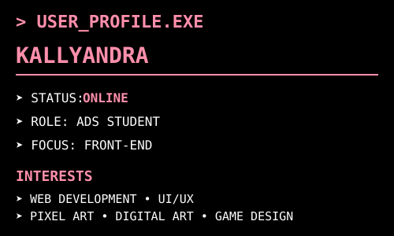

<div align="center">

_KALLYAN ᨳ𐔌՞҂ ˕ ֊՞𐦯ᜊ_

---

<p align="center">
  
</p>

═ ═══ ═════ ═══════ ▌│█║▌║▌║ ▌│█║▌║▌║ ▌│█║▌║▌║ ═══════ ═════ ═══ ═

### SYSTEM ONLINE

`ANÁLISE E DESENVOLVIMENTO DE SISTEMAS`
•
`FRONT-END DEVELOPMENT | CREATIVE PROJECTS`

</div>

---

<table align="center">
<tr>
  
<td width="45%" align="center">
 <br>
</td>
  
<td>
  
</td>

</tr>

</table>

---
  
## > ABOUT_ME.TXT

```txt
Hello, I'm Kallyandra.

I'm an ADS student currently focused on learning front-end development and building my own projects.

I enjoy combining programming with visual design, digital art, pixel art and game-inspired interfaces.

Currently learning:
HTML • CSS • JavaScript • Git • GitHub
```
###

### SKILLS.EXE

```
▸ DEVELOPMENT
[▰▰▰▰▰▰▰▰▰▱] HTML
[▰▰▰▰▰▰▰▱▱▱] CSS
[▰▰▰▰▰▱▱▱▱▱] JAVASCRIPT
[▰▰▰▰▰▱▱▱▱▱] GIT / GITHUB

▸ CREATIVE
[▰▰▰▰▰▰▰▰▱▱] PIXEL ART
[▰▰▰▰▰▰▰▱▱▱] DIGITAL ART
[▰▰▰▰▰▱▱▱▱▱] UI / UX
```

### TOOLS.EXE

```
▸ DEVELOPMENT
VS CODE • GIT • GITHUB 

▸ DESIGN
PISKEL • ASEPRITE

▸ ORGANIZATION
NOTION

▸ CURRENTLT_LEARNING
[x] HTML                                 [ ] UI / UX
[x] CSS                                  [ ] Game Development
[x] JavaScript                           [ ] Back-End Development
[x] Git & GitHub
[x] Pixel Art
```

### PROJECTS.EXE

```
═════════════════════════════════════════════════════════════════════════════════════════════════════════
▸ 01 — CALCULATOR.EXE
A calculator developed using HTML, CSS and JavaScript

HTML CSS JAVASCRIPT
| OPEN PROJECT →
═════════════════════════════════════════════════════════════════════════════════════════════════════════
▸ 02 — POKEDEX.EXE
A retro-inspired Pokédex combining web development with pixel art and a Game Boy-inspired interface.

HTML CSS JAVASCRIPT PIXEL ART
| OPEN PROJECT →
═════════════════════════════════════════════════════════════════════════════════════════════════════════
▸ 03 — PORTFOLIO.EXE
My personal portfolio website.

HTML CSS JAVASCRIPT
| OPEN PROJECT →
═════════════════════════════════════════════════════════════════════════════════════════════════════════
```

### CREATIVE_TOOLKIT.EXE

```
👾 PIXEL ART
🎨 DIGITAL ILLUSTRATION 
🧚🏽‍♀️CHARACTER DESIGN
💾ASSET CREATION
🌼 UI DESIGN
```

```
CONNECT.WITH.ME

GitHub
(https://github.com/KallySilva)

LinkedIn
www.linkedin.com/in/kallyandra-silvats
```

###
###
###

```
                                                 END OF FILE_
                                                      ♡
                                            THANK YOU FOR VISITING.
                                                     ...
```
